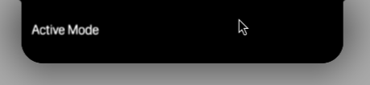
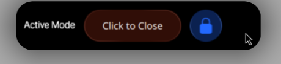

order: 2
title: Your First Notch Application
sidebar_title: First Notch App
extra_css:
    - "../css/images.css"

So you want to make a notch app? Here's how to get started.

So first we have to know a bit about the Notch API and what an app looks like.

## Notch Design

This is what the Notch looks like without an app.


But if you were to have an app running it would be seperated into 3 different looks  
The first one is the **Notch Indicative Mode**  
In this mode the app tries to be small and simple to make sure that the user won't be distracted.  


Now when hovering normally nothing happens, but in the backend it switches to a new mode.  
This mode is called **Notch Informative Mode**  

Here it normally just get a bit bigger, but by changing properties like `meta.informativeHeight` you can make it bigger or smaller.  

For example, in this case we make it bigger by setting `meta.informativeHeight: meta.indicativeHeight + 20`.


And finally the **Notch Active Mode**



This mode is activated when clicked on, and it's where you can finally let your creative juices flow.

!!! warning "Blurry?"
    Sadly that is the best we can do with the internals of Quickshell, but we're working on a fix.

## Your First Notch App

The first thing you need to do is to create a new Notch Application.

To create a new Notch Application you first have to create a new QML file.

```bash
$ mkdir MyNotchApp
$ cd MyNotchApp
$ touch Main.qml
```

And then inside the file create the Notch Application.
A Notch Application consists of these parts:

### The [imports](https://doc.qt.io/qt-6/qtqml-syntax-imports.html)

The Imports are at the top of your file and define the modules you want to use.

```qml
import QtQuick
import Quickshell
import qs
import qs.ui.controls.auxiliary.notch // required for NotchApplication
import qs.ui.controls.primitives // required for CFText, CFI, CFVI, ...
```

### The NotchApplication

The NotchApplication is the main part of your Notch App.

```qml
NotchApplication {
    id: root // The id of your Notch App, this should always be `root`
    details.version: "Elephant-1" // This is the API version
    details.appType: "indicator" // This is the app type, it can either be indicator or media
    // The height and width of your App while in Active Mode
    meta.height: 60
    meta.width: 300
    // notch.defaultHeight is a special property that defines the default height of your Notch App
    meta.indicativeHeight: notch.defaultHeight // The height of your App while in Indicative Mode
    meta.informativeHeight: meta.indicativeHeight+20 // The height of your App while in Informative Mode

    onlyActive: false // Set this to true if you want to make your app active by default and only active
    isActive: false // Set this to true if you want to make your app active by default
    noMode: false // Prevents the app from switching modes
    // This is rather for eqSh itself and not recommended
    immortal: false // Will keep the app running even if it's not focused and prevents it from being killed by the system

    indicative: // see the next section
    active: // see the next section
}
```

You most likely won't need to have that many properties, this is a minimal example:

```qml
NotchApplication {
    id: root
    details.version: "Elephant-1"
    details.appType: "indicator"
    meta.height: 60
    meta.width: 300

    indicative: // see the next section
    active: // see the next section
}
```

### The Indicative Mode

```qml
indicative: Item {
    CFText { // This is provided by eqsh and is an improved version of Text
        anchors.top: parent.top
        anchors.topMargin: 6
        anchors.left: parent.left
        anchors.leftMargin: 10
        text: "Indicative Mode"
    }
}
```

### The Active Mode

```qml
active: Item {
    CFText {
        id: text
        anchors.verticalCenter: parent.verticalCenter
        anchors.left: parent.left
        anchors.leftMargin: 10
        text: "Active Mode"
    }
    NotchButton { // This is provided by eqsh
        id: close
        width: 120
        anchors.verticalCenter: parent.verticalCenter
        anchors.left: text.right
        anchors.leftMargin: 10
        text: "Click to Close"
        color: "#ffffff"
        onClicked: root.closeMe()
    }
    NotchButton {
        id: test
        iconSource: "file:///home/enviction/Downloads/lock.svg"
        iconSize: 20
        anchors.verticalCenter: parent.verticalCenter
        anchors.left: close.right
        anchors.leftMargin: 10
        color: "#ffffff"
        backgroundColor: "#502369ff"
        iconColor: "#2369ff"
    }
}
```

This is what it would look like when you run it.



### Tips & Tricks

The NotchApplication has a few properties that you can use to make your Notch App next-level.

!!! info "Do you want to know if the App is focused?"
    use `root.isFocused`

!!! info "Make the app close after 5 seconds?"
    set the `meta.closeAfterMs` property to 5000  
    `-1 makes it never exit`

!!! info "Want it to not be closed when another app is focused?"
    Use `appType: "media"`

!!! info "Got a close button?"
    Then you're going to need this: `root.closeMe()`

!!! info "The right side of my notch is too long if I only have text on the left side"
    There's a special property for that: `meta.xOffset: -50` which moves the notch 50px to the left