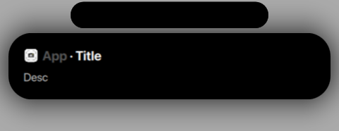

order: 5
title: Banners and Popups
sidebar_title: Popups

A popup is an extension of the notch, in which you can show information to the user. You can use them to show Toasts, Banners, and more.



## How to create a Popup

A popup is created like anything in eqSh, using the cli.

```bash
$ equora ipc popup openPopup iconPath appName title description timeout aargs
```

Example:

```bash
$ equora ipc popup openPopup '' 'MyPopup' 'This is a Title' 'This is a description' 200 ''
```

If you make the iconPath empty, then it will use no icon.
Also, a popup will close after the timeout ends, but if you want to close it manually, just drag it down or click anywhere on it.

## Customizing

Now you might have already noticed the last argument of the command, `aargs`. This is a list of arguments that will be passed to the popup, heres the different arguments and the syntax to use them.

!!! info ""
    **Arguments Syntax**
    `arg, arg, arg=value, arg`

| Argument | Description |
| --- | --- |
| `banner` | Show the popup as a banner, making it not close automatically |
| `attention` | Adds a red glow around the popup |

That's it for now!

## Example

Here's some example popups

```bash
$ equora ipc popup openPopup '' 'Screenshot' 'Screenshot Taken' 'Saved to /home/user/Pictures' 2500 ''
$ equora ipc popup openPopup '' 'Screentime' 'Your Screentime looks good' 'You spend 13% less time on your computer than last week' 200 'banner'
$ equora ipc popup openPopup '' 'Trasher' '1.6 GB of trash' 'You should clean up your trash' 2500 'attention'
$ equora ipc popup openPopup '' 'Meds' 'Remember to take your meds' 'Take them now' 200 'banner,attention'
```