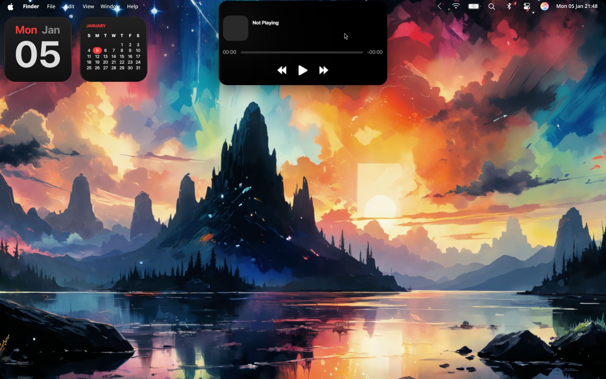
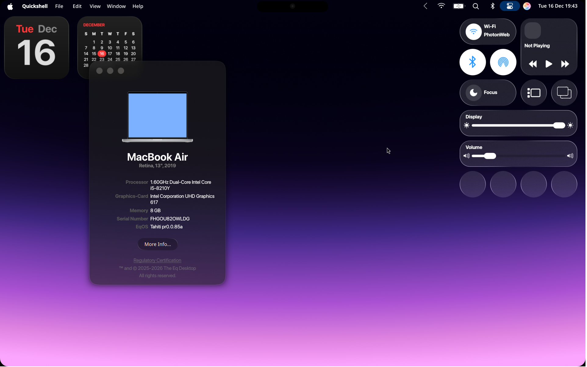
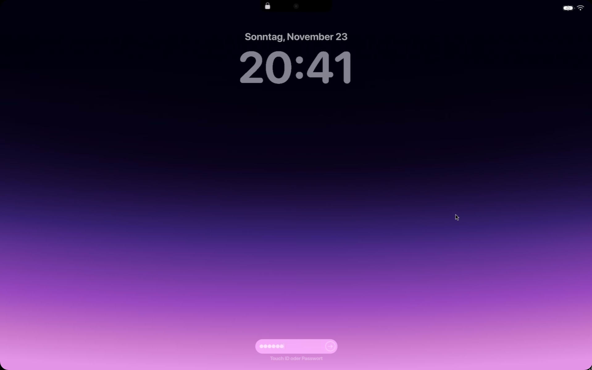
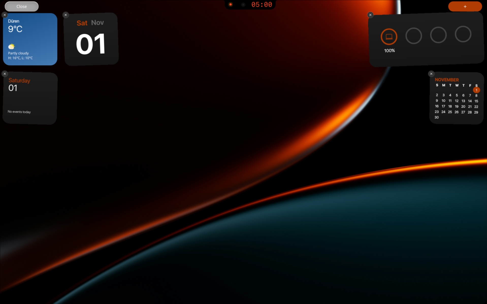
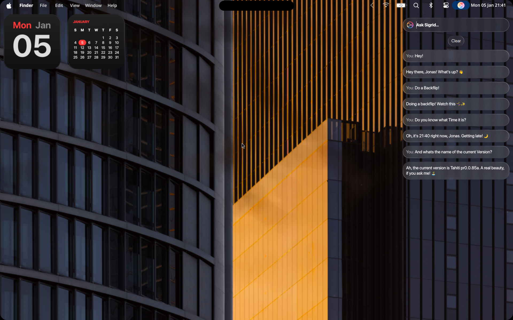
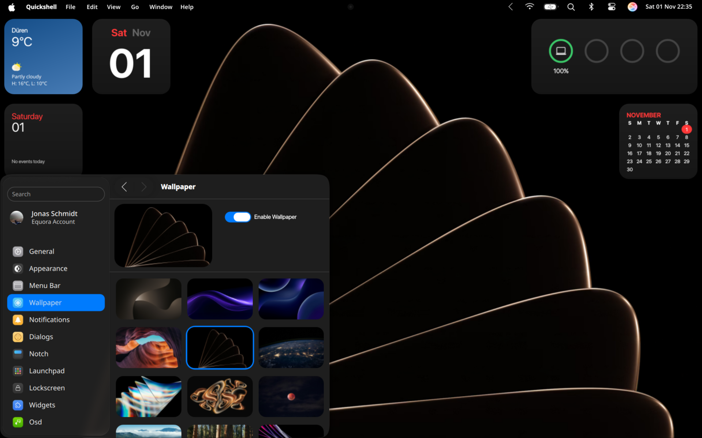
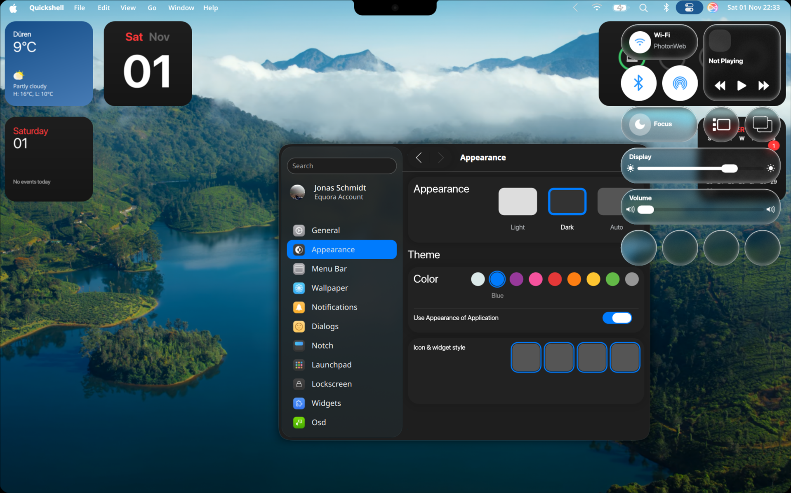

order: 5
description: Showcase of the eq-Sh and all it's features
keywords: docs, eqsh, desktop, linux, equora, quickshell, hyprland, showcase, images
author: enviction
image: ./assets/eqsh.svg
sidebar_title: Showcase
title: Showcase

/// caption
The Dynamic Island being Opened and showing a Music Player UI
///

/// caption
The Control Center of eqSh with the newest Liquid Glass UI
///

/// caption
EqSh' Lockscreen with a gradient wallpaper and the Password being entered
///

/// caption
Widgets of eqSh wobbling around while being edited
///

/// caption
Lockscreen of eqSh with a very nice wallpaper
///

/// caption
Sigrid – The AI Assistant of eqSh – in a Conversation
///

/// caption
Clean Desktop with the Settings App open
///

/// caption 
Early version of eqSh with the old UI
///